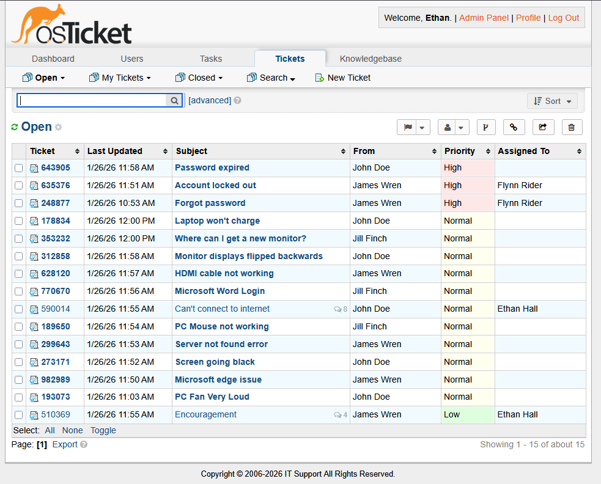

# OsTicket Lab on Ubuntu Server


## Overview

The objective of this home lab was to successfully setup a functioning  self-hosted OsTicket server on my home network and learn about ticketing systems.

Requirements:

- Use Ubuntu Server (no GUI)
- Successfully use SSH to configure the server
- Install OsTicket through apache.
- Practice managing the ticketing system.

## Technologies Used

Ubuntu Server, VirtualBox, SSH, apache, MySQL, OsTicket, php

## Build Journal

### 1. Installing Ubuntu Server in VirtualBox

- Downloaded the official Ubuntu Server ISO.
- Created a new VirtualBox VM and went through the typical Ubuntu Server install.

### 2. Initial System Setup

- Configured automatic updates through the unattended-upgrades package.
- Set up SSH for remote configuration from a Windows terminal.

### 3. Installing LAMP Stack (Apache, MySQL, PHP)

- Installed Apache web server, MySQL database server, PHP, and required PHP extensions:

`sudo apt install apache2 mysql-server php php-mysql php-imap php-xml php-intl php-mbstring php-apcu php-gd php-curl unzip -y`

### 4. MySQL Database Configuration

- Ran MySQL secure installation script:

`sudo mysql_secure_installation`
  - Set root password
  - Removed anonymous users
  - Disallowed remote root login
  - Removed test database
  - Reloaded privilege tables

- Created dedicated database and user for osTicket:

```sql
  CREATE DATABASE osticket;
  CREATE USER 'osticket_user'@'localhost' IDENTIFIED BY 'strong_password';
  GRANT ALL PRIVILEGES ON osticket.* TO 'osticket_user'@'localhost';
  FLUSH PRIVILEGES;
  EXIT;
```

### 5. Downloading and Installing osTicket

- Downloaded osTicket from official GitHub releases:
```bash
  cd /tmp
  wget https://github.com/osTicket/osTicket/releases/download/v1.18.1/osTicket-v1.18.1.zip
```

- Set up configuration file:
```bash
  cd /var/www/html/osticket
  sudo cp upload/include/ost-sampleconfig.php upload/include/ost-config.php
```
- Configured file permissions for Apache:

### 6. Apache Virtual Host Configuration

- Created Apache virtual host configuration:
```bash
  sudo nano /etc/apache2/sites-available/osticket.conf
```
- Enabled the osTicket site and required Apache modules:
- Disabled default Apache site to prevent conflicts:

### 7. Firewall Configuration
- Added firewall rule to allow HTTP traffic:
```bash
  sudo ufw allow 80/tcp
```

  **Issue encountered:** Initially couldn't access the web interface from browser. The ufw firewall was blocking port 80 by default. Adding this rule resolved the issue.

### 8. Web-Based Installation

- Accessed osTicket installer at the server IP via browser
- Completed installation wizard with and connection the MySQL database

### 9. Post-Installation Security

- Secured configuration file permissions:
```bash
  sudo chmod 0444 /var/www/html/osticket/upload/include/ost-config.php
```
  
  **Note:** Changed from 666 (read+write for all) to 444 (read-only for all) to prevent unauthorized modifications to database credentials.

- Deleted setup directory to prevent reinstallation:
```bash
  sudo rm -rf /var/www/html/osticket/upload/setup
```
  
  **Critical:** The setup directory allows anyone to reinstall osTicket and wipe data. Must be removed after installation.

---

### 10. OsTicket Usage
- Created over 15 tickets from various users across different categories (hardware, software, network, password resets, access requests)

- Assigned various priority levels
- Created multiple Service Desk 'Agents' to respond, troubleshoot, and resolve tickets

- Set up canned responses for frequent scenarios

### Issues Encountered

1. **Web interface inaccessible:** UFW firewall was blocking port 80. Resolved by adding firewall rule.
2. **Apache serving default page:** Default Apache site (000-default.conf) was taking priority over osTicket virtual host. Resolved by disabling the default site.