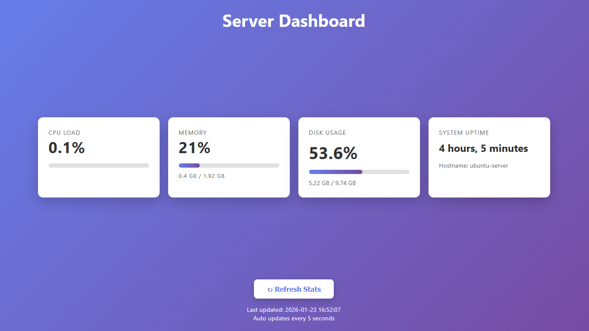
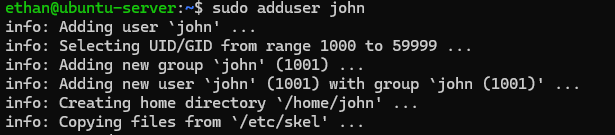
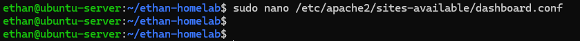
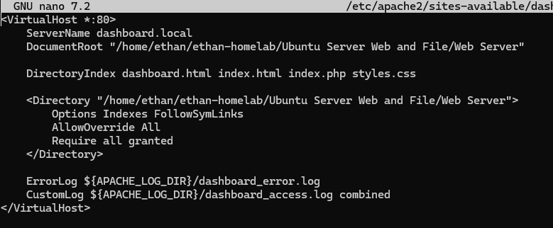

# Ubuntu Server Web and File

## Overview

The objective of this home lab was to successfully setup an Ubuntu server on my home network and configure both a web and file server.

Requirements:

- Use Ubuntu Server (no GUI)
- Successfully use SSH to configure the server
- Install an apache web server and build a simple intranet "Server Dashboard" to monitor server stats
- Configure a basic file server for those on the network

## Technologies Used

Ubuntu Server, VirtualBox, SSH, apache, php, html

## Build Journal

### 1. Installing Ubuntu Server in VirtualBox

Each section should contain steps taken, why certain decisions were made, screenshots, problems and fixes, outcome.

- Downloaded the official Ubuntu Server ISO.
- Created a new VirtualBox VM and went through the typical Ubuntu Server install.

### 2. Initial Setup
- Configured automatic updates through the unattended-upgrades package.
- Configured the timezone through timedatectl set-timezone.
- Set up SSH to be able to remote configure from a Windows terminal.
- Enabled ufw firewall and added a rule to allow SSH.
- Installed neofetch and htop for system info and diagnostics.
- Set up a second user with limited privelages
    

### 3. Apache Web Server Setup
- Installed apache2
- Added a rule to the ufw firewall to allow Apache (HTTP).
- Started and enabled the apache2 service, was able to access the site via IP address from a separate device.
- Built base code for the site on Github and used git to clone the repository to the server.
- Installed `php` and `libapache2-mod-php` to allow PHP to run on the server.
- Set up a virtual host with a custom domain for the site by creating a new .conf file
    

   
    - ❌ Had to add the Directory Index line to tell the site to load dashboard.html instead of loading the whole directory listing.
- Installed `stress` to stress test the memory and CPU to see if the dashboard was working as expected. 
